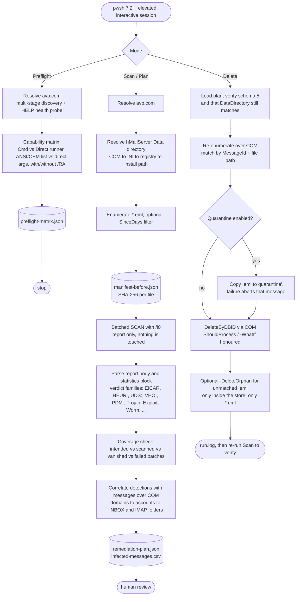

# hMailServer + Kaspersky Cleanup

<p align="center">
  
  
  
  
  
</p>

<p align="center"><b>Audit an hMailServer message store with the local Kaspersky console client in report-only mode, review the findings, and delete only confirmed infected messages through the hMailServer COM API.</b></p>

---

## Repository and developer

| Item | Value |
| --- | --- |
| Repository | <https://github.com/paulmann/hmailserver-kaspersky-cleanup> |
| Purpose | Kaspersky (`avp.com`) based audit and reviewed remediation of infected messages in an hMailServer store |
| Companion project | [hmailserver-clamav-cleanup](https://github.com/paulmann/hmailserver-clamav-cleanup) — the same workflow built on ClamAV/`clamd` |
| Author | Mikhail Deynekin (**@paulmann**) |
| E-mail | <git@deynekin.com> |
| Web | <https://deynekin.com/> |
| License | MIT |
| Language | PowerShell 7.2+ (`pwsh`), Windows only |
| Status | Field-tested against Kaspersky 21.25 on a live mail server |

---

## Table of contents

- [Why this exists](#why-this-exists)
- [Repository contents](#repository-contents)
- [How it works](#how-it-works)
- [Requirements](#requirements)
- [Quick start](#quick-start)
- [Operating modes](#operating-modes)
- [Parameters of Invoke-HMailKasperskyCleanup.ps1](#parameters-of-invoke-hmailkasperskycleanupps1)
- [Artefacts of a run](#artefacts-of-a-run)
- [The remediation plan](#the-remediation-plan)
- [Test-AvpCli.ps1: the behaviour harness](#test-avpclips1-the-behaviour-harness)
- [Exit codes of avp.com](#exit-codes-of-avpcom)
- [Field-measured behaviour](#field-measured-behaviour)
- [Safety guarantees](#safety-guarantees)
- [Scheduling](#scheduling)
- [Troubleshooting](#troubleshooting)
- [Security notes](#security-notes)
- [License](#license)

---

## Why this exists

hMailServer can hand incoming mail to an external virus scanner, but that only protects what arrives **after** the integration works. A store that has been running for years usually contains messages that were accepted before the scanner was configured, or while its databases were stale, or while the integration silently failed.

A plain `avp.com SCAN C:\mail\Data /i2` is not an acceptable answer for a mail store:

- the antivirus would modify or delete `.eml` files behind hMailServer's back, leaving the database pointing at files that no longer exist;
- `.eml` and mbox folder files are containers — the verdict belongs to an object *inside* the message, and only the whole message can be removed safely;
- the console client returns non-zero codes on perfectly successful runs, so a naive wrapper throws away exactly the batches that found something.

This toolkit therefore separates **detection** from **deletion**: Kaspersky always runs with `/i0` (report only), the findings are correlated with real hMailServer messages over COM, written into a reviewable plan, and only a second, explicit run consumes that plan.

---

## Repository contents

| File | Role |
| --- | --- |
| `Invoke-HMailKasperskyCleanup.ps1` | Main tool. Four modes: `Preflight`, `Scan`, `Plan`, `Delete`. Resolves `avp.com` and the hMailServer data directory, scans in batches, parses verdicts, matches them to messages over COM, writes a plan, deletes on demand with an optional quarantine copy. |
| `Test-AvpCli.ps1` | Behaviour harness for `avp.com`. Builds a disposable EICAR corpus and drives the CLI through a full matrix of invocation forms, recording exit codes, reports, verdicts and survival of the target. Also serves as a reusable `avp.com` locator via `-ResolvePathOnly`. |
| `README.md` | This document. |

---

## How it works



Three design decisions carry the whole tool:

1. **Verdicts come from the report, not from the exit code.** A scan that finds an object it cannot process returns exit code `3` while the task itself completes and writes a full report. `0`, `3`, `101` and `102` are treated as non-fatal; the decision is made from the report body and its `; Total detected:` statistics block.
2. **`avp.com` is discovered, then proven alive.** A pending or failed upgrade leaves a second product folder behind, and that stale build accepts invocations and answers nothing. Every candidate is asked for `HELP`; only a build that answers is used. Newest-folder-wins is not sufficient.
3. **Deletion goes through hMailServer, never through the antivirus.** `DeleteByDBID` keeps the database and the file system consistent; the scanner never has permission to touch the store.

---

## Requirements

- Windows with PowerShell **7.2 or newer** (`pwsh`), run **elevated**.
- An **interactive session** in which the resident Kaspersky process (`avp.exe`) is running. Without it the console client cannot execute tasks.
- A Kaspersky build whose `avp.com` answers `HELP` (consumer line or Endpoint Security).
- hMailServer with a working **COM registration** (`hMailServer.Application`) and the Administrator password.
- Reports and quarantine directories located **outside** the message store; the script refuses to run otherwise.

> [!WARNING]
> Back up the hMailServer database **and** the `Data` directory before using `Delete` mode. Deletion is irreversible from the tool's point of view; the quarantine copy is a convenience, not a backup.

---

## Quick start

```powershell
# 0. Prove that the console client is usable on this host and see which invocation forms work
.\Invoke-HMailKasperskyCleanup.ps1 -Mode Preflight

# 1. Optional: full behaviour matrix of avp.com on this build (EICAR based, disposable lab)
.\Test-AvpCli.ps1 -Runner Both

# 2. Audit the last 24 hours, report only, nothing is modified
.\Invoke-HMailKasperskyCleanup.ps1 -Mode Scan -SinceDays 1 -BatchSize 40

# 3. Audit the whole store, keeping every batch artefact for inspection
.\Invoke-HMailKasperskyCleanup.ps1 -Mode Scan -UpdateDatabases -KeepBatchArtifacts

# 4. Review, then remediate from the reviewed plan (dry run first)
$plan = 'C:\mail\reports\kaspersky\run-20260811-221500\remediation-plan.json'
.\Invoke-HMailKasperskyCleanup.ps1 -Mode Delete -PlanPath $plan -WhatIf
.\Invoke-HMailKasperskyCleanup.ps1 -Mode Delete -PlanPath $plan
```

Use `Test-AvpCli.ps1` as a locator from your own scripts:

```powershell
$avp = .\Test-AvpCli.ps1 -ResolvePathOnly -Quiet
& $avp.Path SCAN 'C:\mail\spool' /i0

# or cache the result for another process
.\Test-AvpCli.ps1 -ResolvePathOnly -PathFormat Json -Quiet | Set-Content .\avp-location.json
```

---

## Operating modes

| Mode | Touches the store | What it does |
| --- | --- | --- |
| `Preflight` | no | Discovers and health-probes `avp.com`, then runs a capability matrix against a disposable clean probe message and writes `preflight-matrix.json`. Stops there. |
| `Scan` | read only | Manifest, batched report-only scan, verdict parsing, coverage accounting, COM correlation, plan and CSV. |
| `Plan` | read only | Identical to `Scan`; the run is marked as review-only in the plan metadata. |
| `Delete` | **yes** | Consumes a plan, re-verifies every entry over COM, optionally quarantines, then deletes through `DeleteByDBID`. Honours `-WhatIf` / `-Confirm`. |

---

## Parameters of `Invoke-HMailKasperskyCleanup.ps1`

| Parameter | Default | Meaning |
| --- | --- | --- |
| `-Mode` | `Scan` | `Preflight`, `Scan`, `Plan` or `Delete`. |
| `-AvpPath` | auto | Explicit path to `avp.com`; skips discovery but still health-probed. |
| `-KasperskyRoot` | `C:\Program Files (x86)\Kaspersky Lab` | Extra root that contains product folders. |
| `-DataDirectory` | auto | hMailServer `Data` directory. Resolved over COM, then `hMailServer.INI`, then the registry, then the install path. |
| `-AdminPassword` | prompt | hMailServer Administrator password as a `SecureString`. |
| `-ReportDirectory` | `%SystemDrive%\mail\reports\kaspersky` | Root for run directories. Must be outside the store. |
| `-QuarantineDirectory` | `%SystemDrive%\mail\quarantine` | Root for quarantine copies. Must be outside the store. |
| `-PlanPath` | — | Required in `Delete` mode: the `remediation-plan.json` to consume. |
| `-SinceDays` | `0` (all) | Only messages whose `LastWriteTime` is newer than N days. |
| `-TimeoutMinutes` | `60` | Timeout for a single `avp.com` call. |
| `-BatchSize` | `40` | Messages per scan call; automatically lowered for direct-argument scope. |
| `-Runner` | `Cmd` | `Cmd` (cmd.exe with redirection), `Direct` (.NET pipes) or `Auto`. |
| `-MaxCommandLine` | `7000` | Command-line budget used to bound the batch size. |
| `-IncludeQueue` | off | Also scan loose `.eml` files in the root of the store (the queue). |
| `-UpdateDatabases` | off | Run `avp.com UPDATE` before scanning. |
| `-SkipQuarantine` | off | Delete without keeping a copy. |
| `-DeleteOrphan` | off | In `Delete` mode also remove infected files that no message references. |
| `-KeepBatchArtifacts` | off | Keep per-batch reports even when nothing was found. |
| `-AllowPartialCoverage` | off | Accept partial coverage without the loud warning. |

A single instance is enforced through a global mutex (`Global\Invoke-HMailKasperskyCleanup`).

---

## Artefacts of a run

Everything lands in `<ReportDirectory>\run-yyyyMMdd-HHmmss\`:

| Artefact | Content |
| --- | --- |
| `run.log` | Timestamped `INFO` / `WARN` transcript of the whole run. |
| `avp-health\health-NN.out` | Raw output of every `HELP` probe used to pick the live build. |
| `preflight-matrix.json` | Every runner/scope/report combination with exit code, byte counts and usability. |
| `manifest-before.json` | Path, size, UTC timestamp and SHA-256 of every selected message (hashing is skipped above 50 000 files). |
| `batches\batch-NNNNN.{lst,report,out}` | Scope list, Kaspersky report and captured output per batch. |
| `kaspersky-aggregated.txt` | All batch reports concatenated — the single source of truth for parsing. |
| `unscanned-files.json` | Written when coverage is partial: the files that were not scanned. |
| `remediation-plan.json` | The reviewable plan, schema 5. |
| `infected-messages.csv` | Flat view for review: account, folder, message id, date, from, subject, size, verdict, inner object, file. |

Quarantine copies go to `<QuarantineDirectory>\<stamp>\<account>_<id>_<file>.bad`.

---

## The remediation plan

```jsonc
{
  "Schema": 5,
  "CreatedUtc": "2026-08-11T19:15:00.000Z",
  "Mode": "Scan",
  "DataDirectory": "C:\\mail\\Data",
  "AvpPath": "C:\\Program Files (x86)\\Kaspersky Lab\\Kaspersky 21.25\\avp.com",
  "Capability":  { "Runner": "Cmd", "Scope": "ListAnsi", "UseReport": true },
  "Statistics":  { "Processed": 18422, "TotalOk": 18420, "Detected": 1, "Suspicions": 1, "Skipped": 1, "Corrupted": 0, "Errors": 0 },
  "Coverage":    { "Intended": 18422, "Scanned": 18422, "Unscanned": 0, "VanishedAfter": 0, "FailedBatches": 0, "Complete": true },
  "Detections":  [ { "Path": "...\\{ID}.eml", "Verdict": "HEUR:Exploit.MSOffice.Generic", "InnerObject": "//attachment.rtf//equation", "Detected": true, "Skipped": true } ],
  "MatchedMessages": [ { "Account": "user@example.com", "Folder": "INBOX", "MessageId": 40213, "Subject": "Official Purchase Order", "Verdict": "HEUR:Exploit.MSOffice.Generic" } ],
  "Orphans": []
}
```

`Delete` mode refuses a plan whose `Schema` is not `5`, or whose `DataDirectory` no longer matches the resolved store, or that references any path outside the store. Entries that changed since the scan are skipped and counted rather than deleted blindly.

---

## `Test-AvpCli.ps1`: the behaviour harness

The harness answers a single question: *what does this particular Kaspersky build actually accept?* It builds a disposable corpus from the EICAR test string — plain file, file in a Cyrillic directory, `.eml` with a base64 attachment, mbox folder file, ZIP archive — and then records, per case, the exit code, elapsed time, the first line of output, whether `/RA` and `/R` produced a report, how many verdicts appeared, and whether the target survived.

| Group | What is probed |
| --- | --- |
| `help`, `state` | `HELP`, `HELP SCAN`, `STATUS`, `STATISTICS` |
| `error` | unknown command, scan of a non-existent path |
| `target` | directory, Cyrillic directory, single file, no action switch |
| `container` | `.eml` with attachment, mbox folder file |
| `list` | scope lists in ANSI, OEM, Unicode and UTF-8, plus an empty list |
| `report` | `/RA:` and `/R:` |
| `depth`, `filter` | `/fa`, `/fe`, `/fi`, `/e:A`, `/e:BM` |
| `auth` | `EXPORT` with and without credentials |
| `action` | `/i1`, `/i2`, `/i8` — only with `-IncludeDestructive`, only on throwaway copies |

Key switches: `-Runner Cmd|Direct|Both`, `-SkipEicar` (clean corpus only, for a pure syntax matrix), `-IncludeDestructive`, `-SkipAuthProbe`, `-SkipLivenessProbe`, `-ResolvePathOnly` with `-PathFormat Object|Path|Json`, `-Quiet`.

Outputs land in `<LabRoot>\output\`: `avp-cli-matrix.csv`, `avp-cli-matrix.json`, `summary.md` and `harness.log`.

> [!NOTE]
> Real-time protection deletes EICAR objects while the matrix runs. The harness never asks you to disable protection or add exclusions: it rebuilds the corpus per runner and records a case whose target vanished as *corpus lost* instead of pretending a missing file produced a result.

Credentials are handled carefully. Endpoint Security accepts `/login=<user>` together with `/password=<secret>`; the consumer line accepts `/password` only and has no account name. Credentials are appended solely to commands documented as protected (`ACTIVATE`, `ADDKEY`, `DISABLE`, `EXIT`, `EXPORT`, `IMPORT`, `LICENSE`, `MDRLICENSE`, `PAUSE`, `RESTORE`, `RESUME`, `SELFPROTECTION`, `STOP`). Invalid credentials are never probed, because repeated failures lock the Password-protection account.

---

## Exit codes of `avp.com`

| Code | Meaning | Treated as fatal? |
| --- | --- | --- |
| `0` | operation completed successfully | no |
| `1` | invalid parameter value | yes |
| `2` | unknown error | yes |
| `3` | task completion error — in practice objects were detected and left unprocessed | **no** |
| `4` | task cancelled | yes |
| `101` | all dangerous objects processed | no |
| `102` | dangerous objects detected | no |
| `-10` | undocumented; observed with the `/@:` scope-list form | yes |
| `-1` | the script could not start or wait for the process | yes |

---

## Field-measured behaviour

Everything below was measured on a live server, not assumed:

- **Exit code `3` is normal on a productive store.** An earlier revision discarded exactly those batches and reported zero detections on a store that did contain an exploit-carrying message.
- **UTF-16 scope lists are rejected** by this product line and waste minutes doing so, so only ANSI and OEM lists — plus direct arguments with a bounded command line — are considered.
- **`SCAN` and `UPDATE` do not accept `/login` or `/password`.** Passing them breaks the invocation, so credentials are never appended to those commands.
- **A stale product folder behaves like a working one.** It accepts the invocation and returns `3` with no output for every command, which fills a matrix with identical meaningless failures. Hence the `HELP` health probe.
- **Verdicts describe container hierarchies**, for example `<path>.eml//attachment.rtf//equation → suspicion → HEUR:Exploit.MSOffice...`. The base `.eml` path identifies the hMailServer message; the remainder identifies the object inside it. Lines that only say `ok`, or that describe an archive layer, carry no verdict and are ignored.
- **Report parsing is bilingual.** English and Russian state words (`suspicion` / `detected` / `skipped` and the Cyrillic equivalents) are all recognised, and report files are decoded from BOM, UTF-16 or the OEM code page.

---

## Safety guarantees

- Kaspersky is **always** invoked with `/i0`. The antivirus never modifies or deletes anything in the store.
- Deletion happens only in `Delete` mode, only from a plan you have reviewed, and only through the hMailServer COM API.
- `SupportsShouldProcess` with `ConfirmImpact = 'High'`: `-WhatIf` and `-Confirm` work as expected.
- Reports and quarantine must live outside the message store; the script throws if they do not.
- Orphan removal refuses anything that is not a `*.eml` file inside the store.
- A failed quarantine copy aborts the deletion of that message.
- Every path from a plan is re-validated against the current store before use.
- A global mutex prevents two concurrent runs.
- The Administrator password lives only as a `SecureString`; the harness additionally masks secrets in the log, CSV, JSON and console, and in the `Cmd` runner passes the password through a process environment variable substituted by `cmd.exe`.

---

## Scheduling

Because the console client needs the resident process in an interactive session, a fully unattended full-store scan is not always possible. A practical compromise is a daily *audit-only* run that alerts a human:

```powershell
$action  = New-ScheduledTaskAction -Execute 'pwsh.exe' `
  -Argument '-NoProfile -File "C:\tools\Invoke-HMailKasperskyCleanup.ps1" -Mode Plan -SinceDays 2'
$trigger = New-ScheduledTaskTrigger -Daily -At 03:30
Register-ScheduledTask -TaskName 'hMail Kaspersky audit' -Action $action -Trigger $trigger -RunLevel Highest
```

Then review `infected-messages.csv` and run `Delete` by hand.

---

## Troubleshooting

| Symptom | Cause and fix |
| --- | --- |
| `No avp.com build answered the HELP command` | The resident process is not running, the session is not interactive or not elevated, or every candidate belongs to a stale installation. Verify manually: `avp.com HELP SCAN`. |
| `No avp.com invocation form produced parseable output` | Same checklist; inspect the captured output under `run-*\preflight\`. |
| `Cannot create hMailServer.Application` (`0x80040154`) | COM is not registered, or the process bitness does not match. Re-register hMailServer and run the matching `pwsh`. |
| `hMailServer authentication failed` | Wrong Administrator password; pass `-AdminPassword` as a `SecureString`. |
| Statistics report detections but no path was parsed | Inspect `kaspersky-aggregated.txt`; the report layout of that build differs. Open an issue with the relevant lines. |
| Coverage is partial | Re-run for the paths listed in `unscanned-files.json`, or accept it with `-AllowPartialCoverage`. Detections already found remain valid. |
| `Every scan batch failed` | Run `-Mode Preflight` and read the matrix; usually a dead CLI or a non-interactive session. |
| Messages still visible after deletion | Compact the folders in the mail client, then re-run `Scan` to verify. |

---

## Security notes

This toolkit removes mail from a production store. Treat it as a privileged operation: keep the report directory on a volume with an audit trail, keep quarantine copies until you are certain, and never point `-DataDirectory` at anything you have not backed up. Findings such as `HEUR:Exploit.MSOffice.*` on an `//equation` object mean the message reached a mailbox — investigate whether it was opened, not only whether it is gone.

---

## License

MIT — see [`LICENSE`](LICENSE).

## Author

**Mikhail Deynekin** — <git@deynekin.com> · <https://deynekin.com/> · [@paulmann](https://github.com/paulmann)

If this saved you an incident, a star is appreciated. Issues and pull requests with real report excerpts from other Kaspersky builds are especially welcome.
